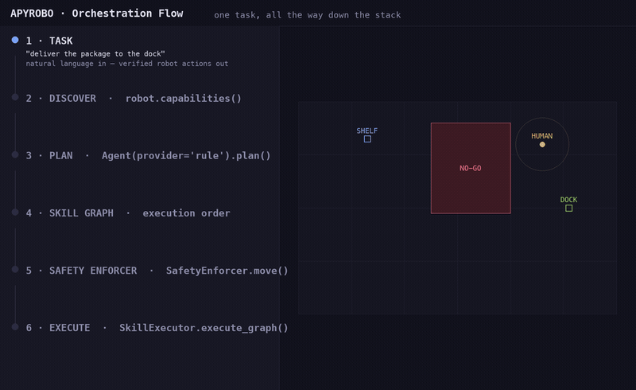
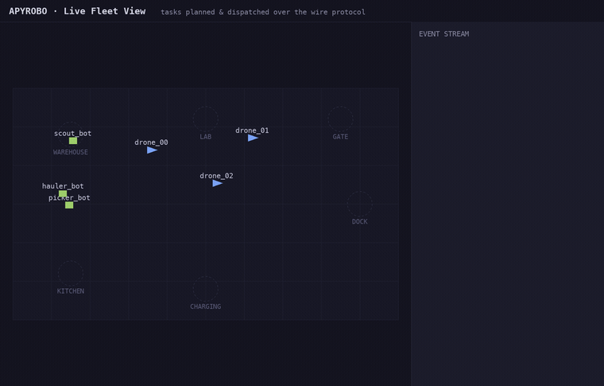

<p align="center">
  <strong>APYROBO</strong><br>
  <em>The open-source AI orchestration layer for robotics</em>
</p>

<p align="center">
  <a href="https://pypi.org/project/apyrobo/"></a>
  <a href="https://github.com/apyrobo/Apyrobo/actions/workflows/ci.yml"></a>
  <a href="https://github.com/apyrobo/Apyrobo/actions/workflows/integration.yml"></a>
  <a href="LICENSE"></a>
  <a href="https://www.python.org/"></a>
  <a href="https://docs.ros.org/en/humble/"></a>
  <a href="https://discord.gg/n3uX7VmrUr"></a>
</p>

---

**APYROBO gives AI agents the runtime to act in the physical world.** It sits on top of [ROS 2](https://docs.ros.org/en/humble/) and provides capability discovery, skill orchestration, swarm coordination, and safety enforcement. One layer, any hardware, any LLM.

```
   "deliver the package to dock 3"
         │
         ▼
   ┌───────────┐   ┌───────────┐   ┌───────────┐   ┌───────────┐
   │ AI Agent  │ → │   Skill   │ → │  Safety   │ → │  ROS 2 /  │
   │ (any LLM) │   │   Graph   │   │ Enforcer  │   │ Hardware  │
   └───────────┘   └───────────┘   └───────────┘   └───────────┘
```

<p align="center">
  
  <br>
  <em><strong>The diagram above, running.</strong> One task — "deliver the package to the dock" — down the whole stack: capabilities discovered, a plan chosen, a requested <code>2.5&nbsp;m/s</code> clamped to <code>0.5</code>, a no-go zone rejected, then executed skill-by-skill as the robot routes to the dock. Every panel is filled by the live objects, not a mock-up. → <a href="demos/orchestration_flow/">how it works</a></em>
</p>

<p align="center">
  
  <br>
  <em>…and at fleet scale — 3 drones + 3 ground robots driven from natural-language tasks over APYROBO's <a href="spec/wire-protocol.md">wire protocol</a>, rendered live in the browser. → <a href="demos/fleet_view/">run it</a></em>
</p>

---

## Why APYROBO

| Challenge | How APYROBO Solves It |
|-----------|----------------------|
| LLMs can't control robots safely | Safety enforcer wraps every command with hard constraints |
| Robot code is tied to hardware | Capability adapters abstract any robot behind a semantic API |
| Multi-robot coordination is ad-hoc | Swarm bus + coordinator handles task splitting natively |
| Skill composition is manual | Skill graph engine chains skills with pre/postconditions |
| No standard AI-robotics interface | Model-agnostic agent layer works with any LLM provider |
| Picking the right LLM for the hardware is hard | Compute profiles auto-select models for any platform |
| Wiring a front-end (Slack, web, ROS) is boilerplate | `apyrobo serve` exposes a standard orchestration interface |

## Features

- **Capability Abstraction** — Semantic API that knows *what* robots can do, not just what topics they publish
- **AI Agent Orchestration** — Natural language to verified skill execution with any LLM (OpenAI, Anthropic, local)
- **Skill Graph Engine** — DAG-based task plans with precondition/postcondition verification and retry logic
- **Safety Enforcement** — Speed clamping, collision zones, watchdog, battery checks, escalation — agents can't bypass
- **Swarm Coordination** — Multi-robot task splitting, proximity safety, deadlock detection
- **Observability** — Structured JSON logging, Prometheus metrics, OpenTelemetry traces, execution replay
- **Multiple Persistence Backends** — JSON file, SQLite, Redis for state that survives crashes
- **Hardware Auto-Discovery** — `apyrobo connect ros2://ur10` detects robot type and loads the right skill package automatically
- **Compute Profiles** — `--profile jetson-orin` / `--profile workstation-gpu` / `--profile cpu-only` configure models for any hardware
- **Orchestration Server** — `apyrobo serve` exposes a JSON stdio interface; plug in Slack, Discord, web UI, or ROS service
- **Skill Package Ecosystem** — real ROS 2 Nav2 skills + the `ros2://` adapter (drives a TurtleBot3 in Gazebo), plus reference scaffolds for UR arms, Spot, Franka, PX4, and AGVs to wire to their vendor SDKs ([packages/](packages/))

---

## See It In Action

Four demos that run on a laptop with **no hardware, no ROS 2, no API keys** —
each `clone → run → watch`. See [`demos/`](demos/) for all of them.

| Demo | What you see | Run |
|------|--------------|-----|
| **[Orchestration flow](demos/orchestration_flow/)** | One task down the whole stack — discover → plan → skill graph → safety → execute — every panel filled by the real objects, robot moving in a sim world | `python demos/orchestration_flow/flow.py` |
| **[Live fleet view](demos/fleet_view/)** | A mixed fleet moving in a browser while tasks are planned and dispatched over the wire protocol — rendered by the [reference TypeScript client](packages/apyrobo-client-ts) | `python demos/fleet_view/server.py` |
| [Warehouse pick-and-pack](demos/warehouse_robots/) | 3 robots fill orders; the `TaskBus` routes each step to the robot with the right capability | `python demos/warehouse_robots/demo.py` |
| [10-drone survey](demos/drone_survey/) | 10 drones sweep a grid in parallel, streaming anomalies as sectors complete | `python demos/drone_survey/demo.py` |
| [NL safety policies](demos/humanoid_nlp/) | Plain-English rules ("never exceed 0.3 m/s near humans") block unsafe tasks at runtime | `python demos/humanoid_nlp/demo.py` |

Swap any `mock://` URI for a real robot URI and the same code drives real hardware.

---

## Quick Start (5 minutes, no ROS 2)

### Install

> **Requirements:** Python 3.10+, pip 21.3+ (run `pip install --upgrade pip` first if on macOS system Python)

```bash
pip install apyrobo            # lean core: adapters, skill graph, rule-based planning, safety
pip install 'apyrobo[llm]'     # + LLM/VLM planning via LiteLLM
pip install 'apyrobo[full]'    # + REST API, registry, dashboard, WebSocket, Slack
```

The bare install is intentionally small (pydantic + pyyaml) and everything in
the Quick Start below works with it. LLM planning needs the `llm` extra.

Or from source:

```bash
git clone https://github.com/apyrobo/apyrobo.git
cd apyrobo
pip install -e ".[dev,llm]"
```

### Discover and Command

```python
from apyrobo import Robot

robot = Robot.discover("mock://turtlebot4")
caps = robot.capabilities()
print(f"Capabilities: {[c.name for c in caps.capabilities]}")
# → ['navigate_to', 'rotate', 'pick_object', 'place_object']

robot.move(x=2.0, y=3.0, speed=0.5)
print(robot.get_position())  # → (2.0, 3.0)
```

### Execute a Skill Graph

```python
from apyrobo import Robot, SkillExecutor, SkillGraph, BUILTIN_SKILLS

robot = Robot.discover("mock://turtlebot4")
graph = SkillGraph()
graph.add_skill(BUILTIN_SKILLS["navigate_to"], parameters={"x": 3.0, "y": 4.0})
graph.add_skill(BUILTIN_SKILLS["pick_object"], depends_on=["navigate_to"])

executor = SkillExecutor(robot)
result = executor.execute_graph(graph)
print(f"{result.status.value}: {result.steps_completed}/{result.steps_total} steps")
# → completed: 2/2 steps
```

### Use an AI Agent

```python
from apyrobo import Robot, Agent

robot = Robot.discover("mock://turtlebot4")

# No API key needed
agent = Agent(provider="rule")

# LLM-backed — any LiteLLM model string
agent = Agent(provider="llm", model="claude-sonnet-4-20250514")

result = agent.execute("go to 5, 3 then pick up the object", robot)
```

| Provider | Description | Requires |
|----------|-------------|---------|
| `rule` | Built-in rule-based planner | Nothing |
| `llm` | LiteLLM-backed (any model) | `pip install 'apyrobo[llm]'` + API key |
| `routed` | Edge/cloud routing via InferenceRouter | `pip install 'apyrobo[llm]'` |
| `auto` | Picks `llm` if litellm is available, else `rule` | — |

### Compute Profiles

Select models automatically for your hardware — no LiteLLM string knowledge required:

```bash
apyrobo exec "patrol zone A" --robot mock://turtlebot4 --profile jetson-orin
apyrobo exec "pick up the box" --robot mock://ur10     --profile workstation-gpu
apyrobo exec "navigate to dock" --robot mock://mir100  --profile cpu-only
```

```python
from apyrobo import Robot, Agent
from apyrobo.compute_profiles import get_profile

profile = get_profile("jetson-orin")
agent = Agent(provider="llm", model=profile.default_llm)
```

| Profile | Target Hardware | Default LLM |
|---------|----------------|-------------|
| `jetson-orin` | NVIDIA Jetson Orin | `ollama/llama3.2` |
| `workstation-gpu` | RTX 3080+ / A100 | `ollama/llama3.1:70b` |
| `cloud` | Cloud VM / CI | `claude-sonnet-4-20250514` |
| `cpu-only` | Laptop / Raspberry Pi | `ollama/qwen2.5:3b` |

### Orchestration Server

Expose APYROBO to any front-end over JSON stdio — wire it to Slack, a web UI, a ROS service, or any other system:

```bash
# stdin → JSON task messages, stdout → JSON responses
apyrobo serve --robot mock://turtlebot4 --provider rule
```

```python
from apyrobo.orchestration import OrchestrationServer, StdioOrchestrationAdapter
from apyrobo import Agent

adapter = StdioOrchestrationAdapter()
server = OrchestrationServer(adapter, Agent(provider="rule"))
server.run()
```

Each line in is a JSON task: `{"task": "navigate to dock", "robot_uri": "mock://turtlebot4"}`.
Each line out is a JSON response: `{"task": "...", "metadata": {"status": "planned"}, "source": "orchestration_server"}`.

### Custom Skills

```python
from apyrobo import Skill, SkillLibrary, Robot, Agent
from apyrobo.core.schemas import CapabilityType

skill = Skill(
    skill_id="inspect_shelf",
    name="inspect_shelf",
    description="Visually inspect a shelf",
    required_capability=CapabilityType.NAVIGATE,
)
lib = SkillLibrary()
lib.load_json(skill.to_json())

robot = Robot.discover("mock://turtlebot4")
agent = Agent(provider="rule", library=lib)
result = agent.execute("inspect shelf A3", robot)
```

See the [full quickstart guide](docs/quickstart_5min.md) for safety enforcement, swarm coordination, and LLM setup.

---

## Skill Packages

The [`packages/`](packages/) directory has two kinds of packages — **real** and
**reference scaffolds** — and it matters which is which ([packages/README.md](packages/README.md)).

**Real today** — these drive a robot or speak a real protocol:

| Package | What it does |
|---------|--------------|
| `ros2://` adapter (core) | Publishes `/cmd_vel`, subscribes `/odom`; **verified in CI driving a TurtleBot3 in Gazebo** ([test](tests/integration/test_gazebo_turtlebot.py)) |
| `apyrobo-skills-ros-nav` | Real ROS 2 **Nav2** skills (`navigate_to_pose`, …) via live action calls |

Together — `ros2://` adapter + `ros-nav` skills + the Gazebo CI job + the
[TurtleBot4 guide](docs/TURTLEBOT4.md) — these form the **flagship reference
stack**: CI drives a physics-simulated TurtleBot3 over `/cmd_vel`+`/odom` on
every commit; TurtleBot4 is the hardware target via the same adapter.
Building an adapter or skill package? Copy this stack, not a scaffold.

**Reference scaffolds** — these **print the motion they *would* perform and
return success; they do not move hardware.** They fix the skill shape (names,
parameters, tests) so wiring one to a vendor SDK is a fill-in-the-body job.
Each warns at registration time.

| Package | Robot | Wire it to |
|---------|-------|-----------|
| `apyrobo-skills-ur` | Universal Robots | `ur_rtde` / UR ROS 2 driver |
| `apyrobo-skills-spot` | Boston Dynamics Spot | `bosdyn` SDK |
| `apyrobo-skills-franka` | Franka Panda | `franky` / `libfranka` |
| `apyrobo-skills-drone-px4` | PX4 drones | MAVSDK / `pymavlink` |
| `apyrobo-skills-agv` | Generic AGVs | fleet API (VDA5050) |
| `apyrobo-skills-turtlebot4` | TurtleBot 4 | use the `ros2://` adapter instead |

Skills register automatically via entry-points. See the [Skill Authoring Guide](docs/skill_authoring.md) to wire a scaffold to real hardware or publish your own.

---

## Architecture

```
┌─────────────────────────────────────────┐
│         Foundation Models / LLMs        │  Any provider (OpenAI, Anthropic, local)
├─────────────────────────────────────────┤
│  ┌─────────────────────────────────┐    │
│  │    APYROBO Orchestration Layer  │    │  This project
│  │                                 │    │
│  │  Capability   Skill     Swarm   │    │
│  │  Adapters     Graph     Coord   │    │
│  │                                 │    │
│  │  Sensor       Safety    Agent   │    │
│  │  Pipelines    Enforcer  Runtime │    │
│  │                                 │    │
│  │  Inference    Observ-   State   │    │
│  │  Router       ability   Store   │    │
│  │                                 │    │
│  │  Orchestration  Compute         │    │
│  │  Server         Profiles        │    │
│  └─────────────────────────────────┘    │
├─────────────────────────────────────────┤
│     ROS 2 (DDS, Nav2, MoveIt, TF2)     │  Industry standard, not replaced
├─────────────────────────────────────────┤
│   Simulators (Gazebo, Isaac Sim)        │
├─────────────────────────────────────────┤
│        Physical Hardware                │
└─────────────────────────────────────────┘
```

---

## Project Structure

```
apyrobo/
├── apyrobo/              # Main package
│   ├── core/             # Capability abstraction, robot discovery, adapters
│   ├── skills/           # Skill graph engine, executor, AI agent integration
│   ├── safety/           # Safety policy enforcement, watchdog, escalation
│   ├── swarm/            # Multi-robot bus, coordinator, proximity/deadlock
│   ├── sensors/          # Sensor pipelines, fusion, world state
│   ├── inference/        # Multi-tier LLM routing, circuit breakers
│   ├── orchestration/    # OrchestrationAdapter ABC, OrchestrationServer, stdio
│   ├── compute_profiles/ # Hardware profile → model mapping
│   ├── hardware/         # Per-robot spec files (reach, DoF, sensors, limits)
│   ├── observability.py  # Structured logging, metrics, tracing, alerting
│   ├── persistence.py    # State store (JSON, SQLite, Redis)
│   └── dashboard.py      # FastAPI metrics/health dashboard
├── packages/             # Skill packages (UR, Spot, Franka, …) + TypeScript wire-protocol client
├── tests/                # 2000+ pytest tests (skills, safety, swarm, chaos)
├── examples/
│   └── workflows/        # 10 ready-made multi-robot workflow scripts
├── docs/                 # Guides, architecture, API reference
├── docker/               # Dockerfile + docker-compose (ROS 2 + Gazebo)
└── .github/workflows/    # CI pipeline, nightly builds
```

---

## Adapters

APYROBO works with any robot through capability adapters:

| Adapter | URI Scheme | Use Case |
|---------|-----------|----------|
| `MockAdapter` | `mock://` | Unit testing, development |
| `GazeboAdapter` | `gazebo://` | Physics-flavored mock (no Gazebo — live sim goes via `ros2://`) |
| `MQTTAdapter` | `mqtt://` | IoT / remote robots |
| `HTTPAdapter` | `http://` | REST-based robot APIs |
| `Nav2Adapter` | `ros2://` | ROS 2 Nav2 navigation stack — real robots **and live Gazebo sims** |
| `MoveItAdapter` | `ros2://` | ROS 2 MoveIt 2 manipulation |

Write your own: see the [Adapter Authoring Guide](docs/adapter_authoring.md).

---

## Connecting to a Robot

| URI Scheme | What it does | Requires |
|------------|-------------|---------|
| `mock://` | Pure Python simulation, no external deps | Nothing |
| `gazebo://` | Physics-aware mock with simulated delays | Nothing |
| `gazebo_native://` | Gazebo-shaped in-memory stand-in (spawn/joints/forces APIs) | Nothing |
| `mujoco://` | MuJoCo-shaped in-memory stand-in | Nothing |
| `ros2://` | Real ROS 2 robot **or live Gazebo sim** via rclpy | ROS 2 + Docker image |

> Only `ros2://` talks to something real. The sim-flavored schemes are
> in-memory stand-ins for developing without a simulator installed — each
> warns at first use. Live physics simulation = `ros2://` against a running
> Gazebo ([proof in CI](tests/integration/README_gazebo.md)).

For your first real robot, use the Docker image which includes ROS 2:

```bash
docker-compose up apyrobo-api
```

---

## Workflow Templates

`examples/workflows/` contains 10 ready-made scripts covering common robotics use cases:

| Script | Description |
|--------|-------------|
| `patrol_loop.py` | Continuous waypoint patrol with configurable dwell time |
| `pick_and_place.py` | Async arm workflow with MoveIt adapter and gripper control |
| `inspection_round.py` | Checkpoint inspection with pass/fail logging and JSON report |
| `charging_cycle.py` | Battery-aware dock/undock loop |
| `shelf_restock.py` | Depot-to-shelf restocking with arm |
| `delivery_run.py` | Multi-stop delivery run with return to base |
| `multi_floor_navigation.py` | Elevator-based floor transitions with map switching |
| `quality_inspection.py` | Async vision-based QA with defect logging |
| `fleet_coordination.py` | Threaded round-robin task dispatch across a robot fleet |
| `voice_commanded_robot.py` | Voice loop with mock or Whisper STT backend |

---

## Documentation

| Document | Description |
|----------|-------------|
| [5-Minute Quickstart](docs/quickstart_5min.md) | Install + mock robot + first task |
| [Demos](demos/README.md) | No-hardware demos: recorded runs (drones, warehouse, NL safety) + a live browser fleet view |
| [Full Docker Setup](docs/QUICKSTART.md) | ROS 2 + Gazebo simulation |
| [Architecture](docs/architecture.md) | Design principles and data flow |
| [Skill Authoring Guide](docs/skill_authoring.md) | Write, test, and publish custom skills |
| [Adapter Authoring Guide](docs/adapter_authoring.md) | Add support for new hardware |
| [Protocol Spec](spec/README.md) | The language-agnostic APYROBO protocol, v1.0 (frozen) |
| [Conformance Suite](docs/conformance.md) | Test any adapter or server against the spec |
| [TypeScript Client](packages/apyrobo-client-ts/README.md) | Wire-protocol SDK for web dashboards and bots |
| [API Reference](docs/api_reference.md) | Auto-generated from docstrings |
| [APYROBO vs Alternatives](docs/comparison.md) | Comparison with RAI, ROS-LLM |
| [Roadmap](ROADMAP.md) | Public milestones and contribution areas |

---

## Roadmap

The path from pre-alpha to category-defining runs through four compounding unlocks: **trust → developer velocity → ecosystem gravity → discoverability**.

| Milestone | Unlock | Focus | Status |
|-----------|--------|-------|--------|
| **v0.1.0–v3.0.0** | Foundation | Core framework, skill packages, compute profiles, orchestration server | ✅ Done |
| **v4.0.0–v7.0.0** | Trust → Discoverability | Production hardening, five-minute success, ecosystem integrations, category-defining demos & docs — shipped together as the `4.0.0` package release | ✅ Done |
| **v8.0.0** | Permanence | The standard protocol — spec **1.0 (frozen)**, conformance suite & badge, TypeScript reference client, RFC governance | 🚧 In progress |

> **Milestone numbers are planning labels, not package versions.** The
> published `apyrobo` package advances by [SemVer](https://semver.org) on its
> own (PyPI is currently the 4.x line) — see
> [API_STABILITY.md](API_STABILITY.md) for the guarantees.

See [ROADMAP.md](ROADMAP.md) for what shipped, what's in flight (v8 Phase 3),
and the four post-v8 arcs — hardware proof, the second implementation, modern
simulation, fleet-scale operations — each with mentored contribution entry points.

---

## Contributing

See [CONTRIBUTING.md](CONTRIBUTING.md) for development setup and guidelines.

```bash
# Run the test suite
pip install -e ".[dev]"
pytest tests/ -v -o "addopts="
```

---

## License

Apache 2.0 — see [LICENSE](LICENSE).

---

<p align="center">
  <strong>APYROBO</strong> · Built on ROS 2 · Open Source · Any Hardware · Any LLM
</p>
