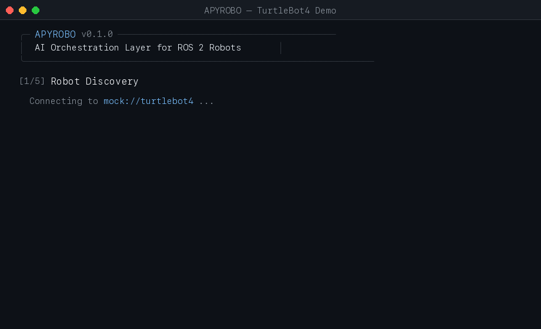

<p align="center">
  <strong>APYROBO</strong><br>
  <em>The open-source AI orchestration layer for robotics</em>
</p>

<p align="center">
  <a href="https://pypi.org/project/apyrobo/"></a>
  <a href="https://github.com/apyrobo/Apyrobo/actions/workflows/ci.yml"></a>
  <a href="https://github.com/apyrobo/Apyrobo/actions/workflows/integration.yml"></a>
  <a href="LICENSE"></a>
  <a href="https://www.python.org/"></a>
  <a href="https://docs.ros.org/en/humble/"></a>
  <a href="https://discord.gg/n3uX7VmrUr"></a>
</p>

---

**APYROBO gives AI agents the runtime to act in the physical world.** It sits on top of [ROS 2](https://docs.ros.org/en/humble/) and provides capability discovery, skill orchestration, swarm coordination, and safety enforcement. One layer, any hardware, any LLM.

```
"deliver the package to dock 3"
        │
        ▼
   ┌─────────┐    ┌───────────┐    ┌──────────┐    ┌─────────┐
   │ AI Agent │ →  │ Skill     │ →  │ Safety   │ →  │ ROS 2 / │
   │ (any LLM)│    │ Graph     │    │ Enforcer │    │ Hardware │
   └─────────┘    └───────────┘    └──────────┘    └─────────┘
```

<p align="center">
  
</p>

### 30-Second Demo

```python
from apyrobo import Robot, Agent

robot = Robot.discover("mock://turtlebot4")        # No ROS 2 needed
agent = Agent(provider="rule")                      # No API key needed
result = agent.execute("go to 3, 4 and pick up the object", robot)
print(result.status)  # → completed
```

---

## Why APYROBO

| Challenge | How APYROBO Solves It |
|-----------|----------------------|
| LLMs can't control robots safely | Safety enforcer wraps every command with hard constraints |
| Robot code is tied to hardware | Capability adapters abstract any robot behind a semantic API |
| Multi-robot coordination is ad-hoc | Swarm bus + coordinator handles task splitting natively |
| Skill composition is manual | Skill graph engine chains skills with pre/postconditions |
| No standard AI-robotics interface | Model-agnostic agent layer works with any LLM provider |
| Picking the right LLM for the hardware is hard | Compute profiles auto-select models for any platform |
| Wiring a front-end (Slack, web, ROS) is boilerplate | `apyrobo serve` exposes a standard orchestration interface |

## Features

- **Capability Abstraction** — Semantic API that knows *what* robots can do, not just what topics they publish
- **AI Agent Orchestration** — Natural language to verified skill execution with any LLM (OpenAI, Anthropic, local)
- **Skill Graph Engine** — DAG-based task plans with precondition/postcondition verification and retry logic
- **Safety Enforcement** — Speed clamping, collision zones, watchdog, battery checks, escalation — agents can't bypass
- **Swarm Coordination** — Multi-robot task splitting, proximity safety, deadlock detection
- **Observability** — Structured JSON logging, Prometheus metrics, OpenTelemetry traces, execution replay
- **Multiple Persistence Backends** — JSON file, SQLite, Redis for state that survives crashes
- **Hardware Auto-Discovery** — `apyrobo connect ros2://ur10` detects robot type and loads the right skill package automatically
- **Compute Profiles** — `--profile jetson-orin` / `--profile workstation-gpu` / `--profile cpu-only` configure models for any hardware
- **Orchestration Server** — `apyrobo serve` exposes a JSON stdio interface; plug in Slack, Discord, web UI, or ROS service
- **Skill Package Ecosystem** — pip-installable skill packages for UR arms, Spot, Franka Panda, PX4 drones, and AGVs

---

## Quick Start (5 minutes, no ROS 2)

### Install

> **Requirements:** Python 3.10+, pip 21.3+ (run `pip install --upgrade pip` first if on macOS system Python)

```bash
pip install apyrobo
```

Or from source:

```bash
git clone https://github.com/apyrobo/apyrobo.git
cd apyrobo
pip install -e ".[dev]"
```

### Discover and Command

```python
from apyrobo import Robot

robot = Robot.discover("mock://turtlebot4")
caps = robot.capabilities()
print(f"Capabilities: {[c.name for c in caps.capabilities]}")
# → ['navigate_to', 'rotate', 'pick_object', 'place_object']

robot.move(x=2.0, y=3.0, speed=0.5)
print(robot.get_position())  # → (2.0, 3.0)
```

### Execute a Skill Graph

```python
from apyrobo import Robot, SkillExecutor, SkillGraph, BUILTIN_SKILLS

robot = Robot.discover("mock://turtlebot4")
graph = SkillGraph()
graph.add_skill(BUILTIN_SKILLS["navigate_to"], parameters={"x": 3.0, "y": 4.0})
graph.add_skill(BUILTIN_SKILLS["pick_object"], depends_on=["navigate_to"])

executor = SkillExecutor(robot)
result = executor.execute_graph(graph)
print(f"{result.status.value}: {result.steps_completed}/{result.steps_total} steps")
# → completed: 2/2 steps
```

### Use an AI Agent

```python
from apyrobo import Robot, Agent

robot = Robot.discover("mock://turtlebot4")

# No API key needed
agent = Agent(provider="rule")

# LLM-backed — any LiteLLM model string
agent = Agent(provider="llm", model="claude-sonnet-4-20250514")

result = agent.execute("go to 5, 3 then pick up the object", robot)
```

| Provider | Description | Requires |
|----------|-------------|---------|
| `rule` | Built-in rule-based planner | Nothing |
| `llm` | LiteLLM-backed (any model) | `pip install litellm` + API key |
| `routed` | Edge/cloud routing via InferenceRouter | `pip install litellm` |
| `auto` | Picks `llm` if litellm is available, else `rule` | — |

### Compute Profiles

Select models automatically for your hardware — no LiteLLM string knowledge required:

```bash
apyrobo exec "patrol zone A" --robot mock://turtlebot4 --profile jetson-orin
apyrobo exec "pick up the box" --robot mock://ur10     --profile workstation-gpu
apyrobo exec "navigate to dock" --robot mock://mir100  --profile cpu-only
```

```python
from apyrobo import Robot, Agent
from apyrobo.compute_profiles import get_profile

profile = get_profile("jetson-orin")
agent = Agent(provider="llm", model=profile.default_llm)
```

| Profile | Target Hardware | Default LLM |
|---------|----------------|-------------|
| `jetson-orin` | NVIDIA Jetson Orin | `ollama/llama3.2` |
| `workstation-gpu` | RTX 3080+ / A100 | `ollama/llama3.1:70b` |
| `cloud` | Cloud VM / CI | `claude-sonnet-4-20250514` |
| `cpu-only` | Laptop / Raspberry Pi | `ollama/qwen2.5:3b` |

### Orchestration Server

Expose APYROBO to any front-end over JSON stdio — wire it to Slack, a web UI, a ROS service, or any other system:

```bash
# stdin → JSON task messages, stdout → JSON responses
apyrobo serve --robot mock://turtlebot4 --provider rule
```

```python
from apyrobo.orchestration import OrchestrationServer, StdioOrchestrationAdapter
from apyrobo import Agent

adapter = StdioOrchestrationAdapter()
server = OrchestrationServer(adapter, Agent(provider="rule"))
server.run()
```

Each line in is a JSON task: `{"task": "navigate to dock", "robot_uri": "mock://turtlebot4"}`.
Each line out is a JSON response: `{"task": "...", "metadata": {"status": "planned"}, "source": "orchestration_server"}`.

### Custom Skills

```python
from apyrobo import Skill, SkillLibrary, Robot, Agent
from apyrobo.core.schemas import CapabilityType

skill = Skill(
    skill_id="inspect_shelf",
    name="inspect_shelf",
    description="Visually inspect a shelf",
    required_capability=CapabilityType.NAVIGATE,
)
lib = SkillLibrary()
lib.load_json(skill.to_json())

robot = Robot.discover("mock://turtlebot4")
agent = Agent(provider="rule", library=lib)
result = agent.execute("inspect shelf A3", robot)
```

See the [full quickstart guide](docs/quickstart_5min.md) for safety enforcement, swarm coordination, and LLM setup.

---

## Skill Packages

APYROBO ships with built-in skills and a growing ecosystem of pip-installable hardware-specific packages:

| Package | Hardware | Skills |
|---------|----------|--------|
| `apyrobo-skills-ur` | Universal Robots UR3/UR5/UR10/UR16 | `move_joints`, `move_linear`, `pick`, `place`, `move_home`, `set_tcp`, `get_pose` |
| `apyrobo-skills-spot` | Boston Dynamics Spot | `walk_to`, `sit`, `stand`, `stair_climb`, `dock`, `capture_image`, `arm_pick` |
| `apyrobo-skills-franka` | Franka Panda | `move_to_pose`, `grasp`, `release`, `move_home`, `cartesian_sweep`, `impedance_control` |
| `apyrobo-skills-drone-px4` | PX4-based drones | `takeoff`, `land`, `fly_to`, `orbit`, `return_home`, `capture_image` |
| `apyrobo-skills-agv` | MiR / Omron LD / Clearpath Husky | `navigate_to`, `follow_route`, `dock_to_station`, `load_cargo`, `unload_cargo` |
| `apyrobo-skills-turtlebot4` | TurtleBot 4 | `patrol_area`, `dock`, `undock`, `follow_person`, `inspect_room` |

```bash
pip install apyrobo-skills-ur
pip install apyrobo-skills-spot
pip install apyrobo-skills-drone-px4
```

Skills register automatically via entry-points — no configuration required. See the [Skill Authoring Guide](docs/skill_authoring.md) to publish your own.

---

## Architecture

```
┌─────────────────────────────────────────┐
│         Foundation Models / LLMs        │  Any provider (OpenAI, Anthropic, local)
├─────────────────────────────────────────┤
│  ┌─────────────────────────────────┐    │
│  │    APYROBO Orchestration Layer  │    │  This project
│  │                                 │    │
│  │  Capability   Skill     Swarm   │    │
│  │  Adapters     Graph     Coord   │    │
│  │                                 │    │
│  │  Sensor       Safety    Agent   │    │
│  │  Pipelines    Enforcer  Runtime │    │
│  │                                 │    │
│  │  Inference    Observ-   State   │    │
│  │  Router       ability   Store   │    │
│  │                                 │    │
│  │  Orchestration  Compute         │    │
│  │  Server         Profiles        │    │
│  └─────────────────────────────────┘    │
├─────────────────────────────────────────┤
│     ROS 2 (DDS, Nav2, MoveIt, TF2)     │  Industry standard, not replaced
├─────────────────────────────────────────┤
│   Simulators (Gazebo, Isaac Sim)        │
├─────────────────────────────────────────┤
│        Physical Hardware                │
└─────────────────────────────────────────┘
```

---

## Project Structure

```
apyrobo/
├── apyrobo/              # Main package
│   ├── core/             # Capability abstraction, robot discovery, adapters
│   ├── skills/           # Skill graph engine, executor, AI agent integration
│   ├── safety/           # Safety policy enforcement, watchdog, escalation
│   ├── swarm/            # Multi-robot bus, coordinator, proximity/deadlock
│   ├── sensors/          # Sensor pipelines, fusion, world state
│   ├── inference/        # Multi-tier LLM routing, circuit breakers
│   ├── orchestration/    # OrchestrationAdapter ABC, OrchestrationServer, stdio
│   ├── compute_profiles/ # Hardware profile → model mapping
│   ├── hardware/         # Per-robot spec files (reach, DoF, sensors, limits)
│   ├── observability.py  # Structured logging, metrics, tracing, alerting
│   ├── persistence.py    # State store (JSON, SQLite, Redis)
│   └── dashboard.py      # FastAPI metrics/health dashboard
├── packages/             # Pip-installable skill packages (UR, Spot, Franka, …)
├── tests/                # 2000+ pytest tests (skills, safety, swarm, chaos)
├── examples/
│   └── workflows/        # 10 ready-made multi-robot workflow scripts
├── docs/                 # Guides, architecture, API reference
├── docker/               # Dockerfile + docker-compose (ROS 2 + Gazebo)
└── .github/workflows/    # CI pipeline, nightly builds
```

---

## Adapters

APYROBO works with any robot through capability adapters:

| Adapter | URI Scheme | Use Case |
|---------|-----------|----------|
| `MockAdapter` | `mock://` | Unit testing, development |
| `GazeboAdapter` | `gazebo://` | Simulation with physics |
| `MQTTAdapter` | `mqtt://` | IoT / remote robots |
| `HTTPAdapter` | `http://` | REST-based robot APIs |
| `Nav2Adapter` | `ros2://` | ROS 2 Nav2 navigation stack |
| `MoveItAdapter` | `ros2://` | ROS 2 MoveIt 2 manipulation |

Write your own: see the [Adapter Authoring Guide](docs/adapter_authoring.md).

---

## Connecting to a Robot

| URI Scheme | What it does | Requires |
|------------|-------------|---------|
| `mock://` | Pure Python simulation, no external deps | Nothing |
| `gazebo://` | Physics-aware mock with simulated delays | Nothing |
| `gazebo_native://` | Real Gazebo bridge via socket | Gazebo running |
| `mujoco://` | MuJoCo physics engine | `pip install mujoco` |
| `ros2://` | Real ROS 2 robot via rclpy | ROS 2 + Docker image |

For your first real robot, use the Docker image which includes ROS 2:

```bash
docker-compose up apyrobo-api
```

---

## Workflow Templates

`examples/workflows/` contains 10 ready-made scripts covering common robotics use cases:

| Script | Description |
|--------|-------------|
| `patrol_loop.py` | Continuous waypoint patrol with configurable dwell time |
| `pick_and_place.py` | Async arm workflow with MoveIt adapter and gripper control |
| `inspection_round.py` | Checkpoint inspection with pass/fail logging and JSON report |
| `charging_cycle.py` | Battery-aware dock/undock loop |
| `shelf_restock.py` | Depot-to-shelf restocking with arm |
| `delivery_run.py` | Multi-stop delivery run with return to base |
| `multi_floor_navigation.py` | Elevator-based floor transitions with map switching |
| `quality_inspection.py` | Async vision-based QA with defect logging |
| `fleet_coordination.py` | Threaded round-robin task dispatch across a robot fleet |
| `voice_commanded_robot.py` | Voice loop with mock or Whisper STT backend |

---

## Documentation

| Document | Description |
|----------|-------------|
| [5-Minute Quickstart](docs/quickstart_5min.md) | Install + mock robot + first task |
| [Full Docker Setup](docs/QUICKSTART.md) | ROS 2 + Gazebo simulation |
| [Architecture](docs/architecture.md) | Design principles and data flow |
| [Skill Authoring Guide](docs/skill_authoring.md) | Write, test, and publish custom skills |
| [Adapter Authoring Guide](docs/adapter_authoring.md) | Add support for new hardware |
| [API Reference](docs/api_reference.md) | Auto-generated from docstrings |
| [APYROBO vs Alternatives](docs/comparison.md) | Comparison with RAI, ROS-LLM |
| [Roadmap](ROADMAP.md) | Public milestones and contribution areas |

---

## Roadmap

| Milestone | Focus | Status |
|-----------|-------|--------|
| **v0.1.0** | Foundation — core abstractions, skill graph, safety, swarm, observability | ✅ Done |
| **v0.2.0** | Handler registry, voice, Nav2/MoveIt adapters, retry, checkpointing | ✅ Done |
| **v0.3.0** | Memory + VLM — episodic/semantic memory, vision-language models, MuJoCo | ✅ Done |
| **v0.4.0** | Fleet & Cloud — fleet manager, Kubernetes, REST API | ✅ Done |
| **v1.0.0** | Stable release — API freeze, PyPI publish, changelog, migration guide | ✅ Done |
| **v1.1.0** | Ship & discover — PyPI pipeline, compute profiles, hardware profiles | ✅ Done |
| **v1.2.0** | Real robot hardening — Nav2 costmap, hardware-in-the-loop CI | ✅ Done |
| **v1.3.0** | Skill ecosystem — skill packages, turtlebot4 reference package | ✅ Done |
| **v2.0.0** | Adaptive intelligence — LLM replanning, VLM task verification, sim-to-real | ✅ Done |
| **v3.0.0** | Universal coverage — UR, Spot, Franka, PX4 drone, AGV skill packages, orchestration server, workflow templates | ✅ Done |

We have items marked **good first issue** and **help wanted** across future milestones.
See [ROADMAP.md](ROADMAP.md) for the full technical roadmap with contribution opportunities.

---

## Contributing

See [CONTRIBUTING.md](CONTRIBUTING.md) for development setup and guidelines.

```bash
# Run the test suite
pip install -e ".[dev]"
pytest tests/ -v -o "addopts="
```

---

## License

Apache 2.0 — see [LICENSE](LICENSE).

---

<p align="center">
  <strong>APYROBO</strong> · Built on ROS 2 · Open Source · Any Hardware · Any LLM
</p>
