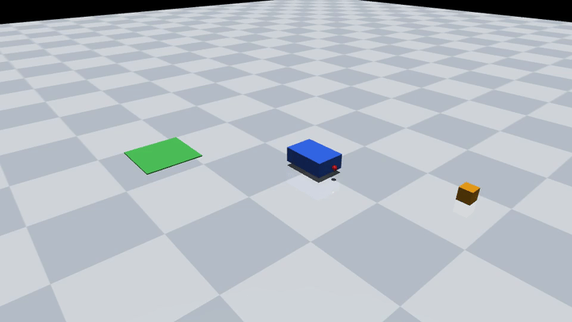

# Pick-and-Place in MuJoCo — NL to Real Physics, Rendered



The rule agent plans *"deliver package from (0.85, 0.42) to (-1.0, -0.8)"*
into a four-skill graph (navigate → pick → navigate → place) and executes
it on the **real `mujoco://` bridge**
([apyrobo/sim/mujoco_bridge.py](../../apyrobo/sim/mujoco_bridge.py)):

- The base drives over with blocking, speed-limited moves — real MuJoCo
  physics, stepped in a background thread, not teleportation.
- `pick_object` → `gripper_close()`: a suction-style grasp welds the box
  at its current pose and lifts it clear of the floor; the constraint
  solver carries it against gravity.
- `place_object` → `gripper_open()`: the box is handed back to gravity
  and lands on the green delivery pad.

Every frame is rendered (offscreen, `mujoco.Renderer`) from the same
simulation state the skills acted on — nothing is staged. The identical
pipeline (same task text, same asserts) runs headless in CI on every
commit: `tests/test_mujoco_bridge.py::TestFullPipeline`.

## Run it

```bash
pip install 'apyrobo[mujoco]'
python demos/mujoco_pickplace/demo.py        # writes demo.mp4, exits 0
                                             # only if physically delivered
./demos/mujoco_pickplace/record.sh           # re-render mp4 + gif
```

No display needed — rendering is offscreen; works on macOS and Linux.

## Bring your own scene

`Robot.discover("mujoco://x", model_path="my_scene.xml")` — the bridge
needs the element names documented in
[mujoco_bridge.py](../../apyrobo/sim/mujoco_bridge.py) (base joints and
actuators, `grip_site`, an inactive `grasp_weld`).
